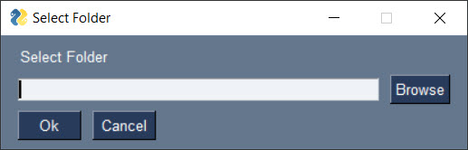
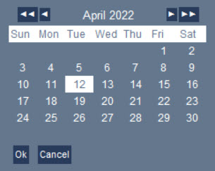
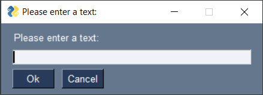
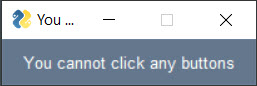
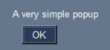
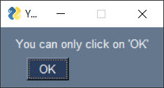
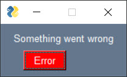
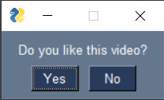
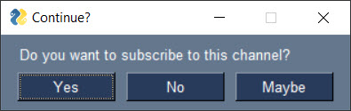

# Make a GUI with just ONE LINE of code using Python

In this Python tutorial, I'm going to show you how to make a GUI with just one line of code - and it's really easy! GUI stands for Graphical User Interface. It is the visual part of a system that a user interacts with. In this video, I will show you how to create GUI with ONE LINE OF CODE using Python and the PySimpleGUI library.

## Video Tutorial
[](https://youtu.be/_H5hsUwv8lE)

## Examples
```python
import PySimpleGUI as sg
```
| Code | Window |
| -- | -- |
| ``` sg.popup_get_folder("Select Folder") ``` |   |
| ``` sg.popup_get_file("Choose Excel file", multiple_files=True, file_types=(("Excel Files", "*.xls*"),),) ``` |   |
| ``` sg.popup_get_date() ``` |   |
| ``` sg.popup_get_text("Please enter a text:") ``` |   |
| ``` sg.popup_no_buttons("You cannot click any buttons") ``` |   |
| ``` sg.popup_no_titlebar("A very simple popup") ``` |   |
| ``` sg.popup_ok("You can only click on 'OK'") ``` |   |
| ``` sg.popup_error("Something went wrong") ``` |   |
| ``` sg.popup_notify("Task done!") ``` |   |
| ``` sg.popup_yes_no("Do you like this video?") ``` |   |
| ``` sg.Window("Continue?",[[sg.T("Do you want to subscribe to this channel?")], [sg.Yes(s=10), sg.No(s=10), sg.Button('Maybe', s=10)]],disable_close=True,).read(close=True) ``` |   |


## Requirements
```
xlwings==0.25.3
PySimpleGUI==4.59.0
```

## 🤓 Check Out My Excel Add-ins
I've developed some handy Excel add-ins that you might find useful:

- 📊 **[Dashboard Add-in](https://pythonandvba.com/grafly)**: Easily create interactive and visually appealing dashboards.
- 🤪 **[Emoji Add-in](https://pythonandvba.com/emojify)**: Add a touch of fun to your spreadsheets with emojis.
- 🛠️ **[MyToolBelt Add-in](https://pythonandvba.com/mytoolbelt)**: A versatile toolbelt for Excel, featuring:
  - Creation of Pandas DataFrames and Jupyter Notebooks from Excel ranges
  - ChatGPT integration for advanced data analysis
  - And much more!

## 🤝 Connect with Me
- 📺 **YouTube:** [CodingIsFun](https://youtube.com/c/CodingIsFun)
- 🌐 **Website:** [PythonAndVBA](https://pythonandvba.com)
- 💬 **Discord:** [Join the Community](https://pythonandvba.com/discord)
- 💼 **LinkedIn:** [Sven Bosau](https://www.linkedin.com/in/sven-bosau/)
- 📸 **Instagram:** [sven_bosau](https://www.instagram.com/sven_bosau/)

## ☕ Support 
If you appreciate the project and wish to encourage its continued development, consider [supporting my work](https://pythonandvba.com/coffee-donation).
[](https://pythonandvba.com/coffee-donation)

## Feedback & Collaboration
For feedback, suggestions, or potential collaboration opportunities, reach out at contact@pythonandvba.com.


If you have any feedback, please reach out to me at contact@pythonandvba.com


