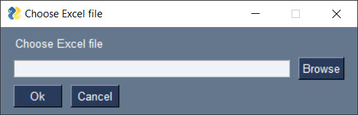

# Make a GUI with just ONE LINE of code using Python

In this Python tutorial, I'm going to show you how to make a GUI with just one line of code - and it's really easy! GUI stands for Graphical User Interface. It is the visual part of a system that a user interacts with. In this video, I will show you how to create GUI with ONE LINE OF CODE using Python and the PySimpleGUI library.

## Video Tutorial
[](https://youtu.be/_H5hsUwv8lE)

## Examples
| Code | Widow |
| -- | -- |
| ``` sg.popup_get_folder("Select Folder") ``` |   |
| ``` sg.popup_get_file("Choose Excel file", multiple_files=True, file_types=(("Excel Files", "*.xls*"),),) ``` |   |
| ``` sg.popup_get_date() ``` |   |
| ``` sg.popup_get_text("Please enter a text:") ``` |   |
| ``` sg.popup_no_buttons("You cannot click any buttons") ``` |   |
| ``` sg.popup_no_titlebar("A very simple popup") ``` |   |
| ``` sg.popup_ok("You can only click on 'OK'") ``` |   |
| ``` sg.popup_error("Something went wrong") ``` |   |
| ``` sg.popup_notify("Task done!") ``` |   |
| ``` sg.popup_yes_no("Do you like this video?") ``` |   |
| ``` sg.Window("Continue?",[[sg.T("Do you want to subscribe to this channel?")], [sg.Yes(s=10), sg.No(s=10), sg.Button('Maybe', s=10)]],disable_close=True,).read(close=True) ``` |   |


## Requirements
```
xlwings==0.25.3
PySimpleGUI==4.59.0
```

## Author

- Sven from Coding Is Fun
- YouTube: https://youtube.com/c/CodingIsFun
- Website: https://pythonandvba.com

[](https://ko-fi.com/X7X47Q0EG)

## Feedback

If you have any feedback, please reach out to me at contact@pythonandvba.com


